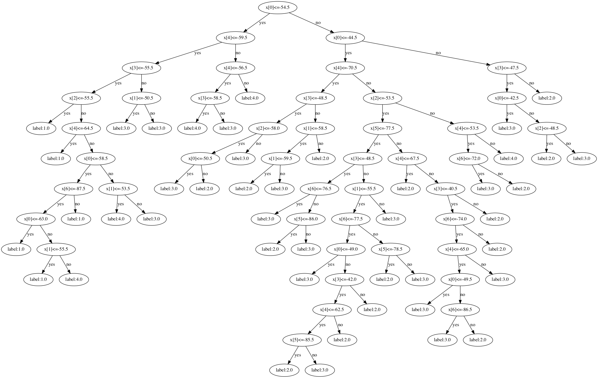
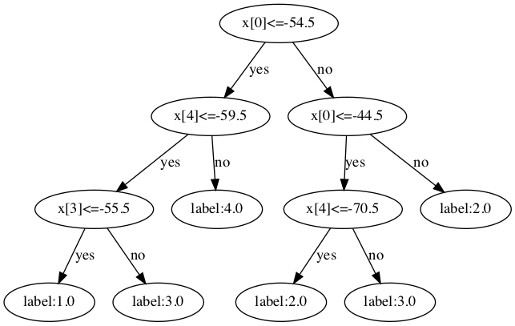
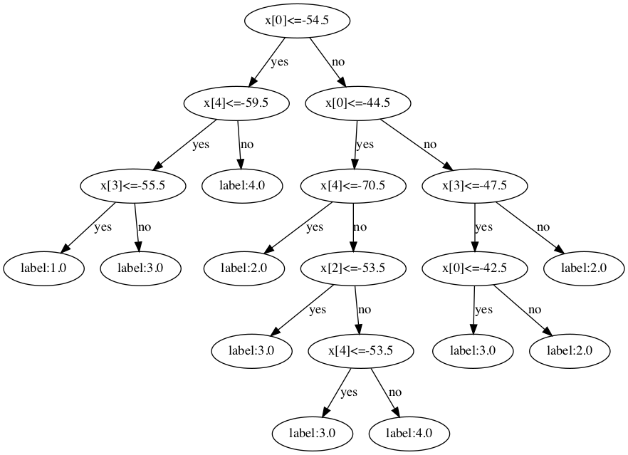

# ID3-decision-tree with pre-pruning and post-pruning
In this assignment, you will implement a decision tree algorithm and use it to
determine one of the indoor locations based on WIFI signal strengths collected
from a mobile phone. 
for more details [Decision Tree Coursework](tutorial.pdf)

# dataset
there are 8 columns, 7 are features(the strength of the signal from seven WIFI), and 1 lable(which room you are in, 4 rooms in total)
two dataset are given, one is [clean_dataset](clean_dataset.txt), the other is [noisy_dataset](noisy_dataset.txt).

# pruning
there are two ways to do pruning in decision trees(pre-pruning and post-pruning)
they evaluate the accuracy in valid dataset to see whether pruning is better than without pruning.
the main difference is, pre-pruning is performed when building the tree, however, post-pruning is performed after the whole tree is built.

# performances

| type  | clean_train_acc | clean_valid_acc | noisy_train_acc |noisy_valid_acc |
| ------------- | ------------- |------------- |------------- |------------- |
| without pruning  | 0.9981  |0.9695 |0.9748 |0.8025  |
| pre pruning  | 0.9617  |0.9580 |0.8770 |0.8740  |
| post pruning | 0.9783  |0.9675 |0.8803 |0.8765  |

## the decision tree(without pruning) visualization
 
## the decision tree(pre pruning) visualization
 
## the decision tree(post pruning) visualization
 

# summary
- It is easy to tell that decision tree without pruning is much more easy to be overfitting, we need to do pruning.
- pre-pruning is tend to create a smaller tree than post-pruning do
- in this case, post-pruning and pre-pruning can improve the ability of generalization and post-pruning has a slightly better performance than pre-pruning.
